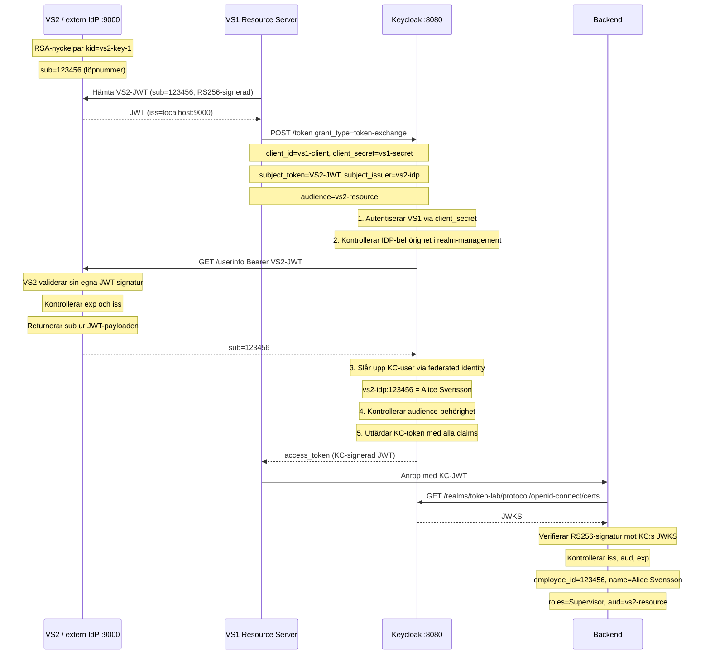

# Token Exchange Lab — RFC 8693 med Keycloak 26.6

Lokal labbmiljö som simulerar extern Token Exchange (RFC 8693):

1. En extern IdP utfärdar en SAML-assert
2. VS2 översätter SAML-asserten till en signerad JWT med användarens löpnummer (6 siffror)
3. VS1 skickar JWT:n till Keycloak för token exchange
4. KC anropar VS2:s `/userinfo` med JWT:n som Bearer — VS2 validerar sin egna signatur och returnerar `sub`
5. KC berikar med namn, e-post, telefon och roller och utfärdar ett KC-signerat token
6. Backenden litar enbart på KC och validerar mot KC:s JWKS

---

## Arkitektur

```
┌─────────────────────────────────────────────────────────────────┐
│  Host (localhost)                                                │
│                                                                  │
│  VS2 / extern IdP (:9000)    VS1 (demo.py / exchange_token.py)  │
│    RS256-nyckelpar                  │                            │
│    /jwks  → publik nyckel           │                            │
│    /userinfo → validerar JWT        │                            │
│         │                           │                            │
│         └──────── Docker-nät ───────┘                            │
│                        │                                         │
│              Keycloak 26.6 :8080                                  │
│                Realm: token-lab                                   │
│                IDP: vs2-idp (OIDC)                               │
│                Klienter: vs1-client, vs2-resource                │
│                User: 123456 (Alice Svensson, roll: Supervisor)   │
└─────────────────────────────────────────────────────────────────┘
```

---

## Sekvensdiagram



---

## Vad KC-tokenet innehåller (backend-perspektiv)

Efter lyckad token exchange och signaturverifiering ser backenden:

| Claim | Exempel | Beskrivning |
|---|---|---|
| `sub` | `310ea7f8-…` | KC-intern UUID |
| `preferred_username` | `123456` | KC-username = VS2-löpnummer |
| `employee_id` | `123456` | VS2-löpnummer (KC-attribut) |
| `name` | `Alice Svensson` | Fullständigt namn |
| `given_name` | `Alice` | Förnamn |
| `family_name` | `Svensson` | Efternamn |
| `email` | `alice.svensson@example.com` | E-postadress |
| `phone_number` | `+46701234567` | Telefon (KC-attribut) |
| `roles` | `["Supervisor", …]` | Realm-roller (platt array) |
| `realm_access` | `{"roles": […]}` | Realm-roller (strukturerat) |
| `azp` | `vs1-client` | Klienten som initierade utbytet |
| `aud` | `["vs2-resource", …]` | Tillåtna audiences |
| `iss` | `http://localhost:8080/realms/token-lab` | Utfärdare (KC) |

---

## Säkerhetsmodellen — vem kan göra exchange?

Flödet kräver **två oberoende kontroller** som båda måste passera:

### Lager 1 — Klientautentisering (VS1 bevisar sin identitet)

```
POST /token  client_id=vs1-client  client_secret=vs1-secret
```

Bara VS1 känner till `vs1-secret`. KC avvisar med `401 unauthorized_client` om hemligheten är fel — **utan att ens kontakta VS2**.

### Lager 2 — VS2-signaturverifiering (tokenet bevisar sin härkomst)

KC anropar VS2:s `/userinfo` med subject_token som Bearer. VS2 verifierar:
- RS256-signaturen mot sin privata nyckel
- att `exp` inte passerat
- att `iss == http://localhost:9000`

Om något av dessa misslyckas returnerar VS2 `401` och KC avvisar exchange med `400 invalid_token`.

### Behörighetsmodellen i KC 25

Keycloak 26 med `admin-fine-grained-authz` hanterar **båda** token exchange-behörigheterna via **`realm-management`-klientens** authz-server:

```
realm-management authz-server
├── token-exchange.permission.idp.<UUID>       ← canExchangeTo: VS1 får använda vs2-idp
│   └── Policy: allow-vs1-exchange [client: vs1-client]
│
└── token-exchange.permission.client.<UUID>    ← canExchangeWith: VS1 får audience=vs2-resource
    └── Policy: allow-vs1-exchange (samma policy)
```

Aktiveras via:
```python
# IDP-behörighet
PUT /admin/realms/token-lab/identity-provider/instances/vs2-idp/management/permissions
{"enabled": true}

# Audience-behörighet
PUT /admin/realms/token-lab/clients/{vs2-resource-uuid}/management/permissions
{"enabled": true}
```

### Verifierade avvisningsfall

Kör `python scripts/verify_rejection.py`:

| Test | HTTP | Felkod | Stoppas av |
|---|---|---|---|
| Giltig token | 200 | — | *(passerar)* |
| Signerad med fel RSA-nyckel | 400 | `invalid_token` | VS2:s `/userinfo` (signatur) |
| Utgången token | 400 | `invalid_token` | VS2:s `/userinfo` (exp) |
| Fel issuer | 400 | `invalid_token` | VS2:s `/userinfo` (iss) |
| Giltig VS2-token, fel client_secret | **401** | `unauthorized_client` | KC:s klientautentisering |

Det sista testet visar att KC avvisar på ett **tidigare lager** (401 vs 400) — VS2 kontaktas aldrig ens.

---

## Snabbstart

```bash
./run_lab.sh
```

Kräver Docker Desktop och Python 3.11+. Kör alla 7 steg automatiskt.

Interaktiv demo (kräver att run_lab.sh körts minst en gång):

```bash
.venv/bin/python scripts/demo.py
```

---

## Steg-för-steg (manuellt)

### 1 — Generera RSA-nyckelpar

```bash
python scripts/generate_keys.py
```

Skapar `keys/private_key.pem` och `keys/public_key.pem`.

### 2 — Starta Docker Compose

```bash
docker compose up -d --build
```

| Tjänst | Port | Beskrivning |
|---|---|---|
| Keycloak 26.6.1 | 8080 | Features: `token-exchange:v1`, `admin-fine-grained-authz:v1` |
| JWKS-server | 9000 | Flask: `/jwks`, `/userinfo`, `/health` |

### 3 — Konfigurera Keycloak

```bash
python scripts/setup_keycloak.py
```

Skapar realm `token-lab`, IDP `vs2-idp`, klienter `vs1-client` och `vs2-resource`.

### 4 — Sätt upp Token Exchange-behörigheter

```bash
python scripts/setup_permissions.py
```

Aktiverar fine-grained permissions för IDP och audience, skapar client-policy för vs1-client.

### 5 — Skapa användare

```bash
python scripts/setup_user.py
```

Skapar KC-användare `123456` (Alice Svensson) med attribut, roll Supervisor, federated identity-länk och protocol mappers i inbyggda scopes.

### 6 — Kör Token Exchange

```bash
python scripts/exchange_token.py
```

### 7 — Verifiera avvisning

```bash
python scripts/verify_rejection.py
```

---

## JWKS-servern (simulerar VS2:s OIDC-lager)

`jwks_server/server.py` exponerar:

| Endpoint | Beskrivning |
|---|---|
| `GET /jwks` | JWKS med RSA-publik nyckel (`kid: vs2-key-1`) |
| `GET/POST /userinfo` | Tar emot JWT som Bearer, verifierar signatur + `iss` + `exp`, returnerar `sub` |
| `GET /health` | Hälsokontroll |

**Varför UserInfo?** KC:s OIDC IDP skickar alltid det inkommande tokenet till `/userinfo` för validering — det är en del av OIDC-protokollet. VS2 behöver ingen separat user store: den validerar sin egna JWT-signatur och läser `sub` direkt ur payloaden.

---

## Manuella curl-kommandon

```bash
# Generera subject_token
SUBJECT_TOKEN=$(.venv/bin/python scripts/issue_token.py)

# Token Exchange
curl -s -X POST http://localhost:8080/realms/token-lab/protocol/openid-connect/token \
  -H "Content-Type: application/x-www-form-urlencoded" \
  -d "grant_type=urn:ietf:params:oauth:grant-type:token-exchange" \
  -d "client_id=vs1-client" \
  -d "client_secret=vs1-secret" \
  -d "subject_token=$SUBJECT_TOKEN" \
  -d "subject_token_type=urn:ietf:params:oauth:token-type:access_token" \
  -d "subject_issuer=vs2-idp" \
  -d "requested_token_type=urn:ietf:params:oauth:token-type:access_token" \
  -d "audience=vs2-resource" | python3 -m json.tool

# KC:s JWKS (för backend-validering)
curl -s http://localhost:8080/realms/token-lab/protocol/openid-connect/certs | python3 -m json.tool

# VS2:s JWKS
curl -s http://localhost:9000/jwks | python3 -m json.tool

# Keycloak Admin UI
open http://localhost:8080   # admin / admin
```

---

## Felsökning

| Symptom | Trolig orsak | Åtgärd |
|---|---|---|
| `Connection refused` på 8080 | Keycloak inte startad | Vänta, kolla `docker compose logs keycloak` |
| `403 Client not allowed to exchange` | IDP- eller audience-behörighet saknas | Kör `setup_permissions.py` |
| `400 token type not supported` | `subject_token_type: jwt` används | Byt till `access_token` — KC 25 stöder bara UserInfo-flödet |
| `400 user info service disabled` | IDP saknar UserInfo-URL eller har `disableUserInfoService: true` | Kontrollera att `userInfoUrl` är satt i `setup_keycloak.py` |
| `400 invalid_token` | VS2 avvisar signaturen | Kontrollera `docker compose logs jwks-server` |
| Saknade claims i token | Mappers inte i inbyggda scopes | KC 25 token exchange evaluerar bara realm-default scopes — mappers måste ligga i `profile`/`roles`-scope |

```bash
# Loggar
docker compose logs -f keycloak
docker compose logs -f jwks-server

# Rensa och börja om
docker compose down
rm -f keys/private_key.pem keys/public_key.pem
./run_lab.sh
```

---

## Projektstruktur

```
token-lab/
├── docker-compose.yml           # Keycloak 26.6 + JWKS-server
├── run_lab.sh                   # Kör hela labbet i ett steg (7 steg)
├── keys/
│   ├── private_key.pem          # RS256-privat nyckel (genereras, ej i git)
│   └── public_key.pem           # Motsvarande publik nyckel (genereras, ej i git)
├── jwks_server/
│   ├── Dockerfile
│   └── server.py                # JWKS + UserInfo Flask-app (simulerar VS2)
└── scripts/
    ├── generate_keys.py          # Genererar RSA-nyckelpar
    ├── setup_keycloak.py         # Skapar realm, IDP, klienter
    ├── setup_permissions.py      # Token Exchange-behörigheter (IDP + audience)
    ├── setup_user.py             # Skapar KC-user med attribut, roll, federated identity
    ├── issue_token.py            # Utfärdar VS2-JWT (simulerar VS2)
    ├── exchange_token.py         # Kör Token Exchange (simulerar VS1)
    ├── demo.py                   # Interaktiv demo — alla 4 steg + backend-vy
    └── verify_rejection.py       # Verifierar att ogiltiga tokens avvisas (5 testfall)
```
